# Quick guide to getting around Barcelona
*By: Nuria Oliva-Jorge Cheng and Tim Cheng*

Welcome! Here's a quick guide to getting around Barcelona. I'll try to cover as much as I can possibly think of, but if you have any other questions, please send me an email and I'll answer them!

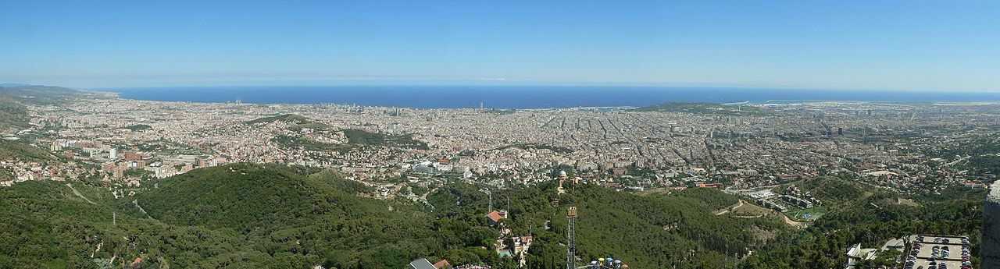

Here are some promotional videos of Barcelona, in case you want a glimpse of the awesomeness you'll get to see in Barcelona!

**Tip: If you see broken images, try disabling adblock plus**

<a href="https://www.youtube.com/watch?v=LORzMhcOrzI" target="_blank">
	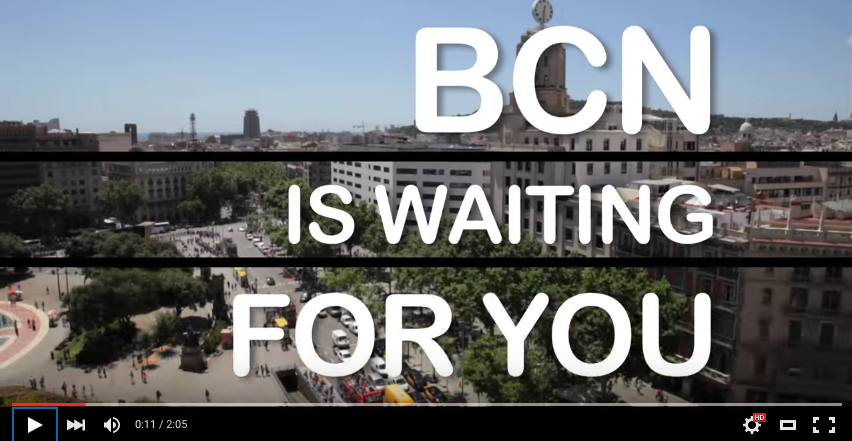
</a>

<a href="https://www.youtube.com/watch?v=6DxX1DYHOlk" target="_blank">
	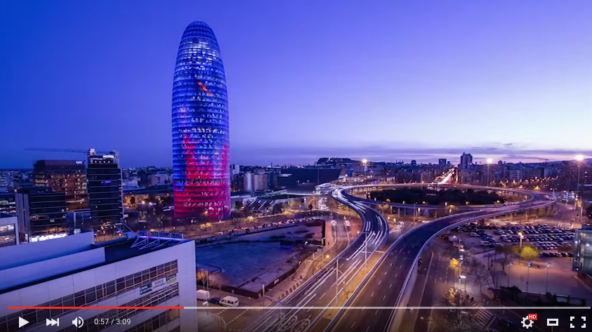
</a>

## Table Of Contents

  - [A Few Facts about Barcelona](#section-id-28)
      - [Fact 1: Barcelona is the second biggest city in Spain, after Madrid](#section-id-32)
      - [Fact 2: We speak BOTH Catalan and Spanish.](#section-id-37)
      - [Fact 3: Barcelona is an extremely easy city to navigate.](#section-id-42)
      - [Fact 4: Be aware of pickpocketing.](#section-id-49)
      - [Fact 5: Saint John's Eve falls on June 23rd](#section-id-54)
  - [Main sights in Barcelona](#section-id-64)
    - [Sagrada Familia](#section-id-68)
    - [Las Ramblas](#section-id-80)
    - [Passeig de Gracia](#section-id-92)
    - [Catedral de Barcelona](#section-id-100)
    - [El Born (Gothic Quarter)](#section-id-108)
    - [Parc Güell](#section-id-116)
    - [Monjuic Castle](#section-id-123)
    - [Mount Tibidabo](#section-id-131)
    - [Camp Nou](#section-id-139)
    - [Horta's Labyrinth Park](#section-id-146)
  - [Restaurants](#section-id-154)
  - [Night Life](#section-id-175)
  - [Day excursions outside Barcelona](#section-id-189)
  - [Hotels downtown Barcelona](#section-id-200)

## A Few Facts about Barcelona

### Fact #1: Barcelona is the second biggest city in Spain, after Madrid
Barcelona is the capital of the autonomous region of Catalonia, located in the northeast of the Iberian Peninsula.

### Fact #2: We speak BOTH Catalan and Spanish. 
If you learned Spanish in highschool, it's time to dust off the basics, because despite popular belief, we do speak both. Most signs, though, such as street names, are in Catalan. In tourist areas, most people will speak something resembling English.

### Fact #3: Barcelona is an extremely easy city to navigate. 
Most of the city is a grid (with the exception of the older areas). Moreover, the city is between the mountains and the sea, so it's simple to orient yourself as long as you know where the mountains and/or the sea are. Bostonians, this should be easy for you...

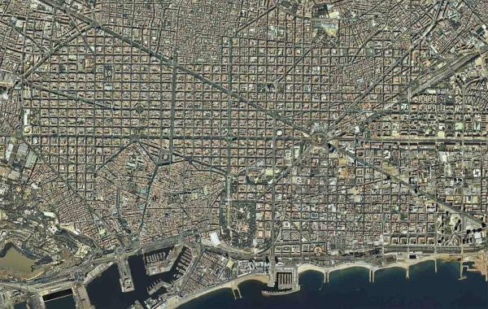

### Fact #4: Be aware of pickpocketing. 
Keep your bags in front of you at all times when you're walking around and leave your passports at the hotel - you will not be asked ID to get alcohol, there is no need to bring your passports with you, and if they want a form of ID, they will accept your US drivers license. When you sit down at a restaurant, always keep your belongings on your lap and your phone inside your bag or pockets, not laying on the table.

### Fact #5: Saint John's Eve falls on June 23rd
In Catalonia and a few other regions in Spain, the night of June 23rd is known as La Revetlla de Sant Joan (Saint John's Eve) or "Nit del foc" (night of fire). We celebrate the summer solstice (longest day and shortest night of the year) with fireworks on the streets and with bonfires at the beach (hence the night of fire...), so be prepared for a loud, long night. Fireworks start about a week before the actual holiday, so expect loud noises any time anywhere.

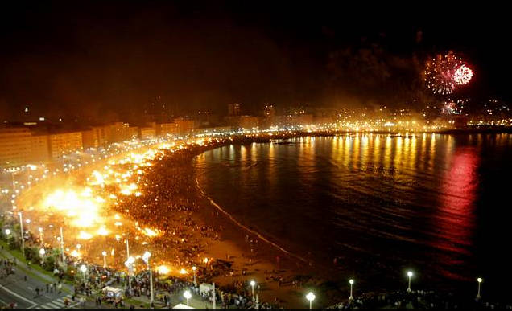

Next, I'll try to highlight my favorite attractions in Barcelona, such as main sights, museums, bars or clubs. However, there is an immense amount of information online if you want to do further research. The [Tourism of Barcelona Website](http://www.barcelonaturisme.com/wv3/en/) will provide you with lots of useful information about the city. [Timeout Barcelona](http://www.timeout.com/barcelona) is very useful to find out about current events going on in the city, such as concerts, plays and other festivities. These are some of the events going on during the summer <http://www.timeout.com/barcelona/festivals/big-festivals-and-major-events-in-barcelona-summer>

## Main sights in Barcelona

### Sagrada Familia

This is probably the most iconic sight of the city of Barcelona. Unfinished cathedral from Catalan architect Antoni Gaudi, who was hit by a train a year after construction started in 1882.

**Tip: Get your tickets a few weeks ahead of time!**

If you want to visit the interior (and you should, it is beautiful), get your tickets online at <http://www.sagradafamilia.org/en/tickets/>, as summer is a very busy time in Barcelona and lines are typically very long. Also, as they have a limited number per day, they tend to run out during summer season.

### Las Ramblas

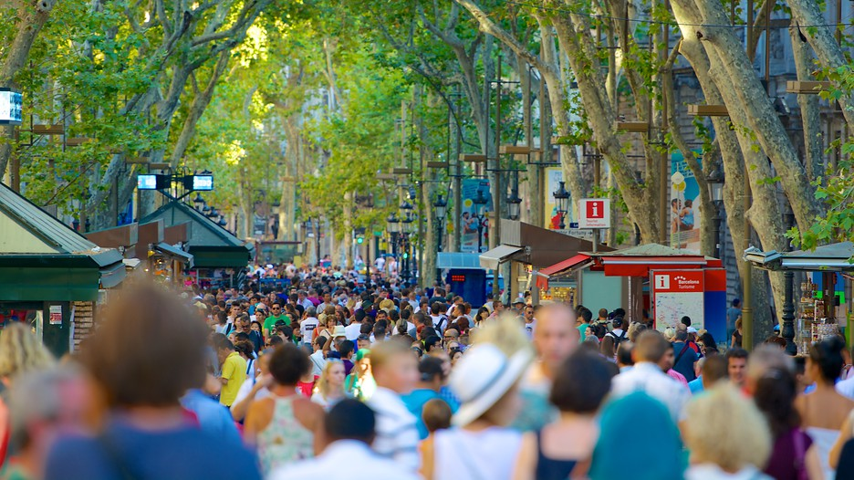

Las Ramblas is a busy street that goes from Plaza Catalunya all the way to the beach. On your way down towards the sea you'll find several attraction such as [Mercat de la Boqueria](http://www.boqueria.info/index.php?lang=en), [Picasso Museum](http://www.museupicasso.bcn.cat/en/), [Liceu theater] (http://www.liceubarcelona.cat/en.html) or Plaça Reial. At the end of Las Ramblas, you'll arrive at Maremagnum, a mall by the water with lots of restaurants in it.

Towards the end of Las Ramblas, there is a pub called [Bosc de les Fades] (http://www.museocerabcn.com/en/bosc.html). It's part of the Wax Museum and the inside is decorated like a rainforest - even if you don't want to drink anything, make sure you pop in and take a look at it.

**Tip: This street probably has the highest pickpocketer density in all of Barcelona. Be extremely cautious.**

### Passeig de Gracia

If you walk from Plaza Catalunya towards the mountain, you'll find yourself in probably the most glamorous avenue in all of Barcelona - Passeig de Gracia. But it's not all luxurious stores... Some of Gaudi's most famous buildings (other than Sagrada Familia) are located in this street: [Casa Batllo](https://www.casabatllo.es/en/) and [La Pedrera](https://www.lapedrera.com/en/home).

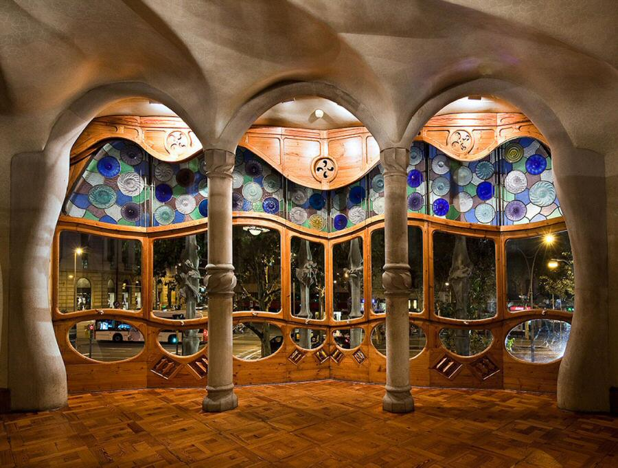

### Catedral de Barcelona

The cathedral of Barcelona, built between 13th and 15th centuries, is located just a 5-minute walk from Plaza Catalunya. After visiting the temple, walk around the winding and narrow streets surrounding the cathedral and discover plenty of hidden, beautiful spots.

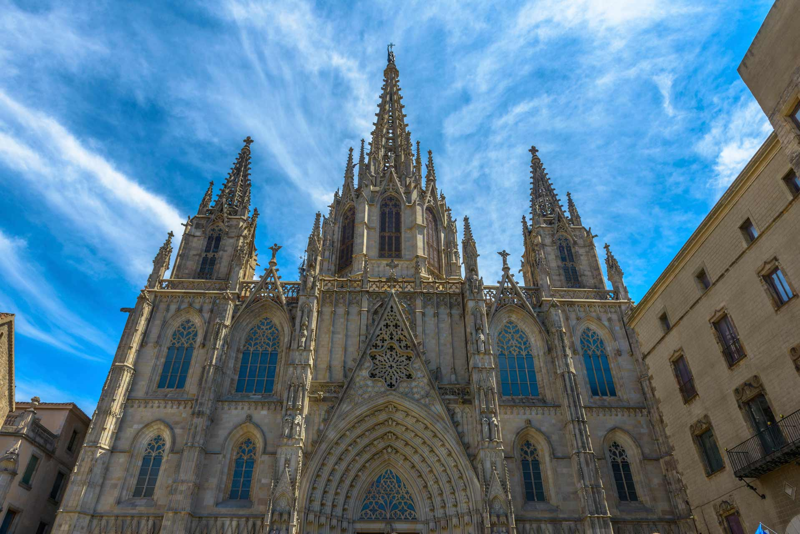

### El Born (Gothic Quarter)

Very vibrant neighborhood frequented mostly by locals and packed with bars and restaurants. Some of the sights located here include Catedral de Santa Maria del Mar and Arc de Triomf. The streets around this area are also narrow and winding, so make sure to have a map or GPS to navigate.

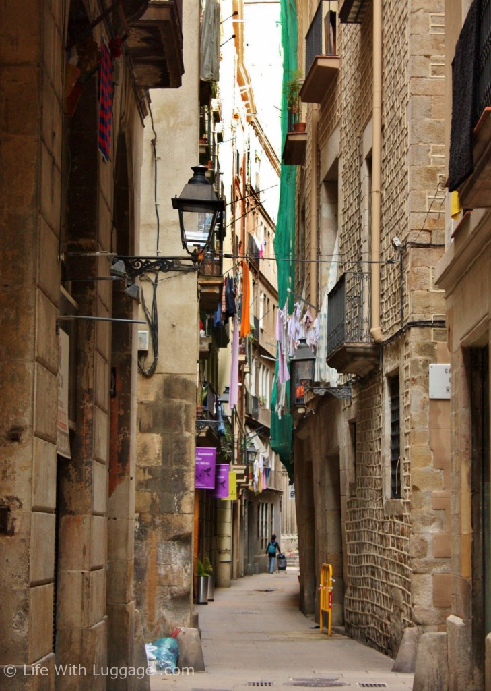

### Parc Güell
Another one of Gaudi's architectural gems in Barcelona with breathtaking views of the city and easy access by public transportation. You can buy tickets online here <http://www.parkguell.cat/en/>.

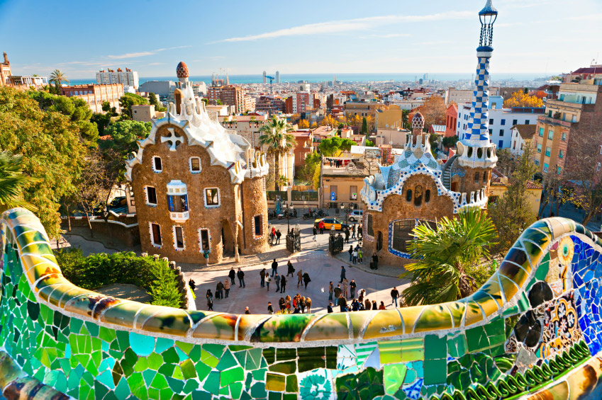

### Monjuic Castle

Old fortress with good views of the city. You can reach there using the [cable railway](https://www.telefericdemontjuic.cat/en/). The cable car stop is located in Parc Monjuic, where you can visit the Museum of Fine Arts and some relics of the Barcelona '92 Olympics, like the Olympic Ring. Right in front of the Museum of Fine Arts there is a fountain called the magic fountain. Every night, there is a light show at the fountain that lasts 2 hours, so make sure to catch some of it! Near the Museum of Fine arts you'll find two Venetian towers, Plaza Espanya and a bullring converted into a mall (bullfighting is illegal in Barcelona).

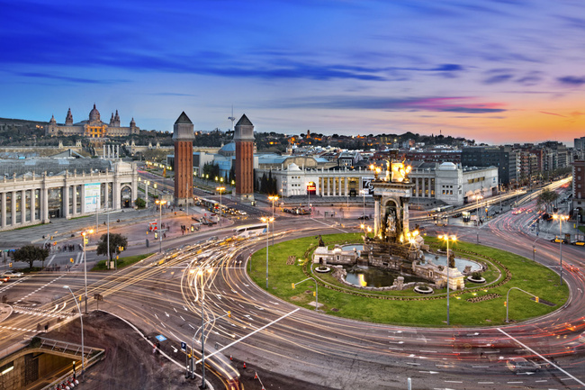

### Mount Tibidabo

Panoramic views of the city from the top of the mountain, where you'll find a cathedral and an [amusement park](https://www.tibidabo.cat/en/).

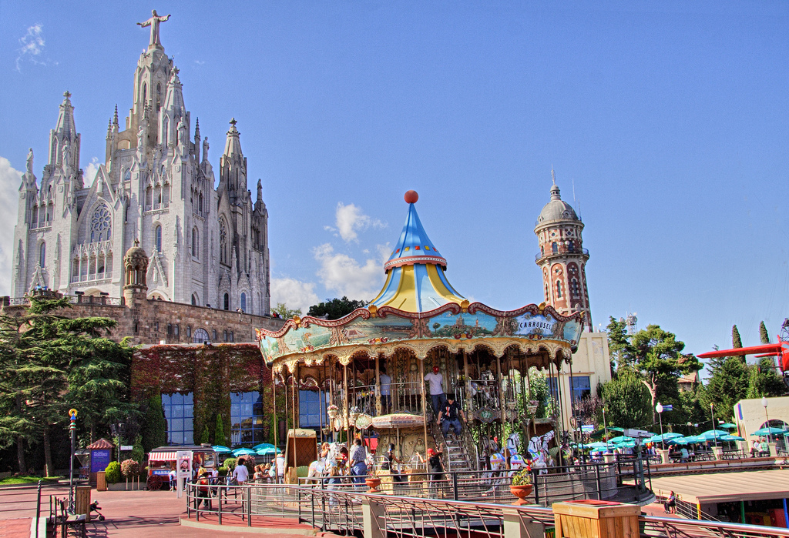

### Camp Nou
Barcelona soccer team stadium. With a seating capacity of 99,750, it is the largest stadium in Spain and in Europe. You can get tickets online here <http://www.fcbarcelona.com/camp-nou> to tour the stadium and visit the museum. Unfortunately the season will be over by June, so there won't be any games going on at the time.

### Horta's Labyrinth Park
Ideal for escaping the city life and get lost in these historical gardens.

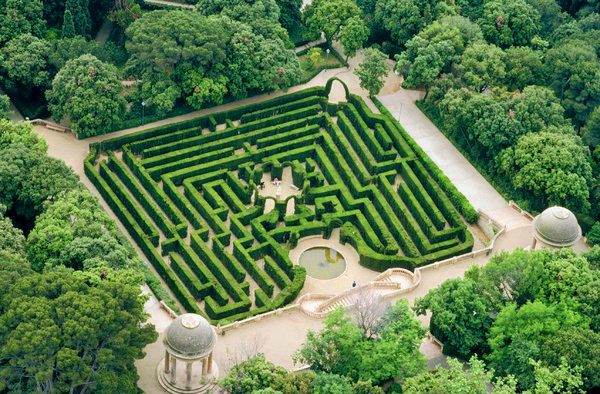

## Restaurants

In general, good and affordable restaurants and tapas bars are outside the city… But I’m going to try to give you a few names of those that I consider good and not a rip off! First piece of advice: never sit down in a terrace of any restaurant in Las Ramblas, it’s a tourist trap and you'll overpay big time.

These two are good restaurants, but VERY expensive:

1. [**Tickets Bar Barcelona**](http://www.barcelonabook.com/tickets-bar-restaurant.html) - molecular gastronomy.
* [**Gaig Restaurant**](http://www.restaurantgaig.com/en/)

The following are affordable restaurants located in downtown Barcelona that offer very good food:

1. [**Restaurant Flamant**](http://www.flamantrestaurant.com/restaurant/index.html) - from the pictures it seems like a high-class restaurant, but it’s actually very affordable, and I think they have prix fixe menus during the week.
* [**Maians**](https://www.google.com/maps/search/Maians,+Barcelona,+Spain/@41.3793493,2.188266,17z/data=!3m1!4b1) (Carrer de Sant Carles, 28, 08003 Barcelona) – amazing hidden gem for a very affordable meal in the neighborhood of La Barceloneta. Must try calamari as appetizer and fideua (typical catalan pasta with seafood) as entrée with a bottle white wine – all for 20-25 euros per person.
* [**Les quinze nits**](http://www.lesquinzenits.com/) - I’m pretty sure it’s from the same owners as Flamant, but the menu is different. Go at lunch during weekday, they have prix fixe menu. Typical Catalan food.
* [**La Fianna**](http://www.lafianna.com/) - Very  good restaurant located in El Born. There is a bar close by called [**Barroc Café**](http://www.barroc-cafe.com/en/). They serve good teas (and mojitos, too!).
* [**Tomas**](http://www.tripadvisor.com/Restaurant_Review-g187497-d945538-Reviews-Bar_Tomas-Barcelona_Catalonia.html) – best patatas bravas (fried wedged potatoes with spicy garlic sauce) in Barcelona. Be aware they mainly sell fried potatoes. However, you can go around the corner into a bar called **Ivorra** and get a full meal with a side of the same exact fried potatoes (same owner, both restaurants share the kitchen).
* [**La rosa del Raval**] (rosaraval.com)/ [**La rosa negra**] (www.rosanegrabcn.com/) – same restaurant, two different locations. Very good Mexican food, even better mojitos.
* [**IceBarcelona**](http://www.icebarcelona.com/en/) - first ice bar at the beach in the world.

## Night Life

Barcelona offers all kinds of styles, so it really depends what your style is. Usually, people go for drinks at bars near the club around 11pm and then head to the clubs around 2 am. Before that time, most clubs are completely empty. It’s critical to pace the drinking, since party goes on until 6 am.

1. [**Razzmatazz**] (http://www.salarazzmatazz.com/) - This is an old factory remodeled into a club with I believe 6 different rooms, each of them with different music styles. There’s a pretty cool dive bar one street down called Dixie’s.
* [**Sala Bikini**](http://bikinibcn.com/bikini/) - Big, fancy club with good music.
* [**Santalo**](https://www.google.com/maps/search/Carrer+de+Santal%C3%B3,+Barcelona,+Spain/@41.3977944,2.1409061,17z/data=!3m1!4b1) is the name of the area surrounding Santalo Street, which is packed with bars and restaurants. Definitely a good spot for pub crawling.
* [**Aribau**](https://www.google.com/maps/place/Carrer+d'Aribau,+Barcelona,+Spain/@41.3924599,2.1517722,17z/data=!3m1!4b1!4m2!3m1!1s0x12a4a29aa27e5479:0xcf713b6c989237bd) is also a good street for bars and clubs of varying styles.
* [**Sutton Club**](http://www.thesuttonclub.com/) - upscale club, slightly overpriced but good music.
* Opium, Shoko and Catwalk are three clubs located by the sea and have terraces facing the beach.
* Arena VIP - gay club downtown Barcelona, near Plaza Catalunya.
* [**Tablao Flamenco**] (http://www.showflamencobarcelona.com/) - don't miss out on a typical Spanish evening at a "tablao flamenco". FYI, flamenco is from the south of Spain, NOT from Barcelona.

## Day excursions outside Barcelona
Most of you won't probably have time to do anything other than visiting the city, but just in case I'd like to recommend you a couple of spots outside of Barcelona where you can go on a day trip.

1. [**Montserrat**](http://www.barcelona-tourist-guide.com/en/tour/montserrat-spain.html) - Beautiful monastery built by the edge of the rocky mountain of Montserrat. Check the website for transportation.
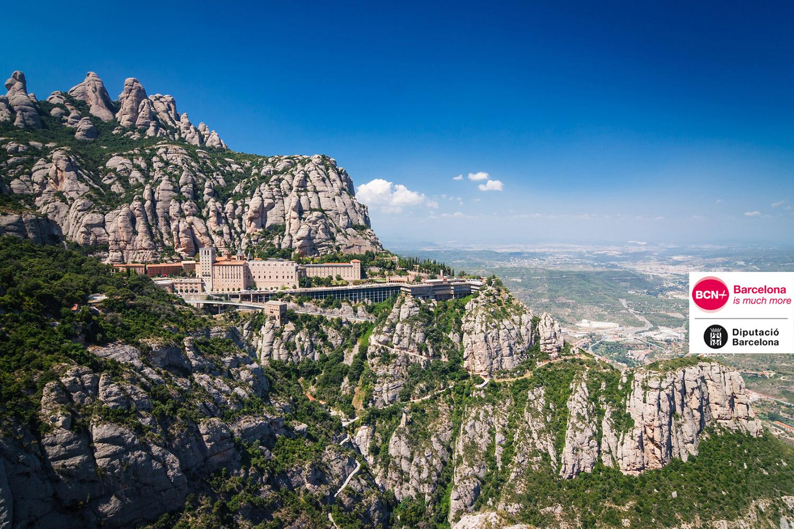
* [**Sitges**] (http://www.visitsitges.com/en/) - Beach town about 25 minutes south of Barcelona.
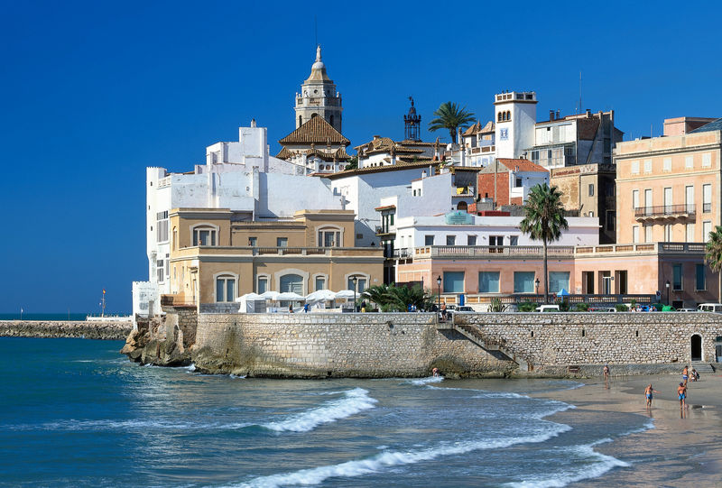
* [**Cadaques/Costa Brava**] (http://www.cadaques.co.uk/) - Beach town about 2 hours north of Barcelona that inspired most of Salvador Dali's artwork.

## Hotels downtown Barcelona
There are thousands of hotels downtown Barcelona. I'd recommend you use a search engine to find a hotel suitable to your budget (<http://orbitz.com>, <http://hotelscombined.com>, etc) - you'll find anything from hostels to five star hotels. My main recommendation is that you book something downtown Barcelona, preferably in the areas surrounding Plaza Catalunya, as most sights are around that area and all metro lines intersect in this area (red circle in the metro map), so you can easily commute anywhere in the city. 

If you are visiting Barcelona choose your [Hola BCN! card] (http://www.tmb.cat/en/barcelona-travel-card) for 2, 3, 4 or 5 (from 14 to 32 euros) days and plan your route around the city and metropolitan area on public transport. This includes metro and bus (TMB), local train (FGC), tram (TRAM) and regional train (Rodalies de Catalunya). The other option is the multi-person travel card valid for 10 intermodal journeys from 1 to 6 zones. In the case of one-zone cards, passengers have 75 minutes between the first and last validation when changing lines or mode of transport. The cost of this card is 9.95 euros.

<a href="images/metro.gif" target="_blank">
	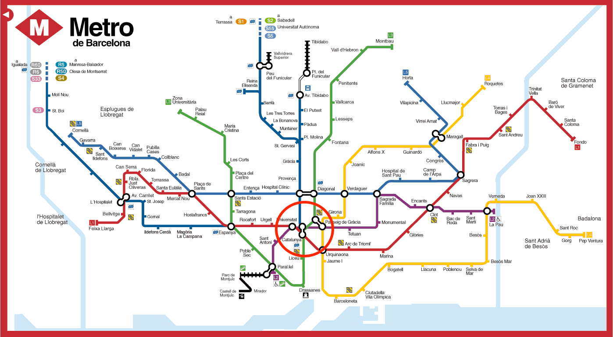
</a>

### We hope you found this useful. Enjoy Barcelona!
